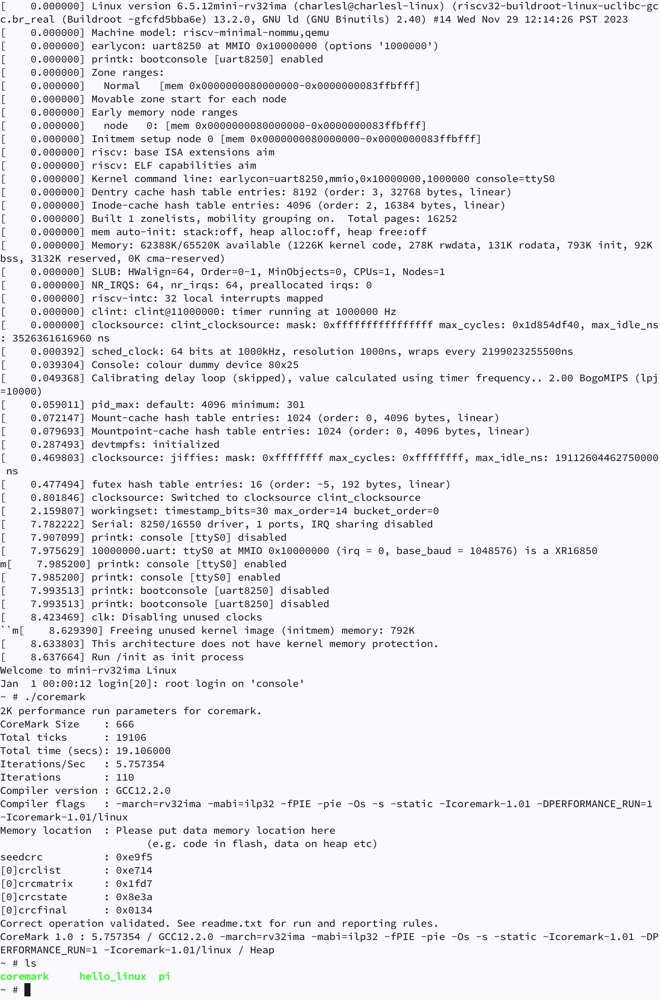

# Linux-on-Python-rv32ima
Run Linux on Python with RISC-V emulator（使用RISC-V模拟器在Python上运行Linux）

### Starting the Emulator（启动模拟器）
To run the emulator, execute `single.py` directly with Python3/PyPy3:
```sh
python single.py
```
```sh
pypy single.py
```

You can also run the equivalent multi-file version of the code.
```sh
python multiple_src/main.py
```
```sh
pypy multiple_src/main.py
```


